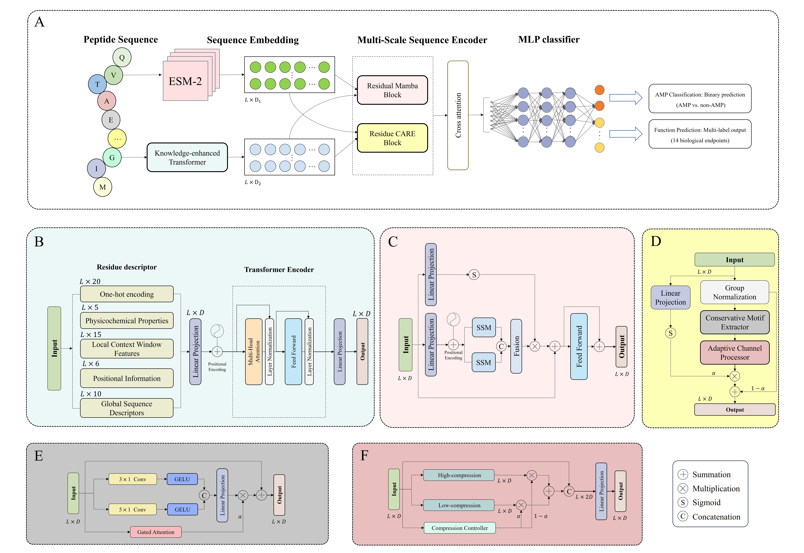

# MAPLE: Interpretable Deep Learning for Antimicrobial Peptide Prediction

MAPLE predicts antimicrobial peptide (AMP) identity and AMP-related functional
activities from peptide sequences. The project combines residue-level ESM-2
embeddings with deterministic physicochemical knowledge features, then uses a
dual-stream neural architecture for AMP screening, functional profiling, and
selectivity-oriented prioritization.



## What is included

- Streamlit interface for local sequence profiling and batch prediction.
- Command-line prediction from CSV input.
- Feature generation for training and evaluation PKL files.
- Training script for binary or multi-label MAPLE checkpoints.
- Evaluation script that exports task metrics to CSV.
- Processed benchmark and independence CSV datasets for AMP screening and 14
  AMP-related functional tasks.
- Optional motif-reference table for the Streamlit interpretation layer.

Pretrained `.pt` checkpoints and generated `.pkl` feature files are not included
in this repository snapshot. Generate PKL files locally before training or
evaluation, and place model checkpoints in one of the layouts described below
before running model-based inference.

## Repository layout

```text
MAPLE/
├── app.py                         # Streamlit application
├── run.py                         # Thin Streamlit launcher
├── predict.py                     # CSV batch prediction
├── Generate_pkl.py                # ESM-2 + knowledge feature PKL generation
├── train.py                       # MAPLE checkpoint training
├── Eval.py                        # Checkpoint evaluation
├── model.py                       # MAPLE model and checkpoint loading helpers
├── data.py                        # Dataset and collate utilities
├── loss.py                        # Focal loss
├── Module/
│   ├── CARE.py                    # CARE residue/channel encoder
│   ├── ProBiMamba.py              # Bidirectional sequence encoder
│   ├── Fusion.py                  # Cross-modal fusion modules
│   └── knowledge_transformer.py   # Optional 56-to-256 knowledge encoder
├── web_core/                      # Streamlit parsing, runtime, UI, and charts
├── Data/
│   ├── demo.csv
│   ├── motif_reference.csv
│   ├── Benchmark/
│   │   ├── AMP/
│   │   └── MTL/
│   └── Independence/
│       ├── AMP/
│       └── MTL/
├── Figure/architecture.jpg
├── LICENSE
└── README.md
```

## Functional labels

MAPLE supports AMP screening plus 14 functional activity labels:

```text
anti_mammalian_cells
antibacterial
antibiofilm
anticancer
antifungal
antigram_negative / antigram-negative
antigram_positive / antigram-positive
antihiv
antimrsa
antioxidant
antiparasitic
antiviral
cytotoxic
hemolytic
```

The Streamlit code uses underscore-normalized names internally. Some dataset and
checkpoint filenames use hyphenated Gram labels, specifically
`antigram-negative` and `antigram-positive`.

## Environment

Python 3.10 is recommended. Install the runtime dependencies manually because
this repository snapshot does not include a `requirements.txt` file.

```bash
conda create -n maple python=3.10 -y
conda activate maple
pip install torch pandas numpy scikit-learn streamlit plotly tqdm fair-esm
```

CUDA is recommended for feature generation and batch inference because ESM-2
embedding extraction is the dominant cost. CPU works for small examples.

## Checkpoints

The code expects trained model weights to be supplied separately.

For the Streamlit app, the default model folder is `MAPLE_checkpoints`. If that
folder is not found, the app also tries `Model` and `checkpoints` under the
repository root. A compatible release-style layout is:

```text
MAPLE_checkpoints/
├── AMP.pt
├── knowledge_transformer.pt
├── thresholds.json
└── label/
    ├── anti_mammalian_cells.pt
    ├── antibacterial.pt
    ├── antibiofilm.pt
    ├── anticancer.pt
    ├── antifungal.pt
    ├── antigram-negative.pt
    ├── antigram-positive.pt
    ├── antihiv.pt
    ├── antimrsa.pt
    ├── antioxidant.pt
    ├── antiparasitic.pt
    ├── antiviral.pt
    ├── cytotoxic.pt
    └── hemolytic.pt
```

The Streamlit app also accepts nested label checkpoints such as
`label/antibacterial/antibacterial.pt`.

For `predict.py` per-label inference, `--label_dir` is read as a flat directory:
the script looks for `<label_dir>/<label>.pt`. Use a flat directory of label
checkpoints, or pass `--checkpoint` to run a single checkpoint produced by
`train.py`.

If checkpoints are missing, the Streamlit interface still validates sequences
and reports sequence-derived descriptors. It does not fabricate probabilities.

## Quick start: Streamlit app

```bash
streamlit run run.py
```

The app supports manual input, CSV upload, and FASTA upload. It reports:

- AMP probability and binary AMP decision when `AMP.pt` is available.
- Functional probabilities for AMP-positive sequences when label checkpoints are
  available.
- Sequence validity, length warnings, and approximate physicochemical
  descriptors.
- Selectivity score defined as `P_antibacterial - P_hemolytic`.
- Priority groups for candidate triage.
- Optional motif-level interpretation when `motif_reference.csv` is present in
  the repository root. This snapshot stores the reference table at
  `Data/motif_reference.csv`.
- Downloadable CSV results and FASTA output for valid sequences.

Functional prediction is only run for sequences that pass the AMP screening
threshold. Sequences that do not pass AMP screening keep AMP-level results and
descriptor fields, but functional activity columns are left unavailable.

## Input formats

CSV input should contain a sequence column. Common column names such as
`sequence`, `seq`, `peptide_sequence`, `peptide`, and `aa_sequence` are detected
by the Streamlit app.

```csv
sequence_id,sequence
pep_001,KWKLFKKIGAVLKVL
pep_002,GIGKFLHSAKKFGKAFVGEIMNS
```

FASTA input is also supported:

```fasta
>pep_001
KWKLFKKIGAVLKVL
>pep_002
GIGKFLHSAKKFGKAFVGEIMNS
```

Valid model input uses the 20 standard amino-acid letters:

```text
ACDEFGHIKLMNPQRSTVWY
```

Unsupported letters such as `B`, `J`, `O`, `U`, `X`, and `Z` are reported as
invalid for model prediction.

## Command-line prediction

Run per-label 14-task prediction from a flat label-checkpoint directory:

```bash
python predict.py \
  --input_csv Data/demo.csv \
  --output_csv outputs/demo_predictions.csv \
  --sequence_col sequence \
  --label_dir MAPLE_checkpoints/label \
  --knowledge_transformer_ckpt MAPLE_checkpoints/knowledge_transformer.pt \
  --device auto
```

Run prediction with a single checkpoint produced by `train.py`:

```bash
python predict.py \
  --input_csv Data/demo.csv \
  --output_csv outputs/single_checkpoint_predictions.csv \
  --sequence_col sequence \
  --checkpoint outputs/antifungal/antifungal.pt \
  --label_cols label \
  --device auto
```

`predict.py` writes a compact CSV containing the input `sequence` column and one
`prob_<label>` column per requested label.

## Feature generation

`train.py` and `Eval.py` consume unified PKL files. Generate these files from
CSV data first:

```bash
python Generate_pkl.py \
  --input_csv Data/Benchmark/MTL/antifungal.csv \
  --output_pkl outputs/features/benchmark_antifungal.pkl \
  --sequence_col sequence \
  --label_cols label \
  --device auto
```

Without `--knowledge_transformer_ckpt`, MAPLE expands deterministic 56-dimensional
knowledge descriptors to the requested knowledge dimension. To use a trained
knowledge transformer, provide its checkpoint:

```bash
python Generate_pkl.py \
  --input_csv Data/Benchmark/MTL/antifungal.csv \
  --output_pkl outputs/features/benchmark_antifungal.pkl \
  --sequence_col sequence \
  --label_cols label \
  --knowledge_transformer_ckpt MAPLE_checkpoints/knowledge_transformer.pt \
  --device auto
```

The generated PKL contains:

- `metadata` with source CSV, label names, ESM model name, and feature dimensions.
- `features`, keyed by sequence hash.
- Per-sequence `esm_features` with 480 dimensions from `esm2_t12_35M_UR50D`.
- Per-sequence `enhanced_knowledge_features`, usually 256 dimensions.
- Stored labels copied from the requested CSV label columns.

## Training

Train a single binary classifier:

```bash
python train.py \
  --data_pkl outputs/features/benchmark_antifungal.pkl \
  --label_cols label \
  --save_dir outputs/models/antifungal \
  --epochs 30 \
  --batch_size 32 \
  --gpu 0
```

When `--label_cols label` is used, the checkpoint name is inferred from the PKL
filename, for example `benchmark_antifungal.pt`. For multi-label training, pass
multiple label columns and the script saves `maple.pt`.

The training script uses focal loss with class-ratio-derived positive weighting
and writes `quad_output_results.json` to the save directory.

## Evaluation

Generate a PKL for the independence split, then evaluate a trained checkpoint:

```bash
python Generate_pkl.py \
  --input_csv Data/Independence/MTL/antifungal.csv \
  --output_pkl outputs/features/independence_antifungal.pkl \
  --sequence_col sequence \
  --label_cols label \
  --device auto

python Eval.py \
  --checkpoint outputs/models/antifungal/benchmark_antifungal.pt \
  --data_pkl outputs/features/independence_antifungal.pkl \
  --label_cols label \
  --threshold 0.5 \
  --device auto \
  --output_dir outputs/eval/antifungal
```

`Eval.py` exports a metrics CSV with binary metrics for single-label checkpoints
and macro/per-label metrics for multi-label checkpoints. `--threshold auto` can
search a threshold for single-label checkpoints when a threshold-search PKL is
provided.

## Data

Included CSV files are organized as:

- `Data/Benchmark/AMP/`: AMP and non-AMP benchmark CSV files.
- `Data/Benchmark/MTL/`: benchmark CSV files for the 14 functional labels.
- `Data/Independence/AMP/`: AMP and non-AMP independence CSV files.
- `Data/Independence/MTL/`: independence CSV files for the 14 functional labels.
- `Data/demo.csv`: small input example for quick prediction tests.
- `Data/motif_reference.csv`: bundled motif reference table. The current
  Streamlit loader looks for `motif_reference.csv` at the repository root, so
  copy or symlink this file there if motif-level interpretation is needed.

The CSV files use `sequence,label` columns. PKL feature files are intentionally
generated locally because they depend on the selected ESM model, max sequence
length, knowledge encoder, and device/runtime environment.

## Model architecture

The MAPLE model has two residue-level input streams:

- ESM-2 embeddings with 480 dimensions.
- Knowledge features built from amino-acid identity, physicochemical properties,
  local windows, positional descriptors, and global sequence descriptors.

Both streams are projected to a shared hidden size and processed through CARE and
ProBiMamba branches. Cross-modal attention fuses CARE-to-CARE,
ProBiMamba-to-ProBiMamba, and cross-branch representations. The pooled fused
features are passed to an MLP classifier for binary or multi-label prediction.

Checkpoint loading includes compatibility remapping from older module names such
as ScConv/ProMamba to the current CARE/ProBiMamba names.

## Reproducibility notes

- Use the benchmark split for model development and the independence split for
  final evaluation.
- Keep threshold selection separate from final independence evaluation.
- Store task thresholds in `thresholds.json` when using the Streamlit app.
- Predictions are computational estimates and require experimental validation.
- Streamlit descriptor values are approximate sequence-derived descriptors, not
  experimental measurements.

## Citation

If you use MAPLE, cite the associated manuscript or project reference:

```text
Liu H, Shi Y, Guo F, Wang J, Li J, Wang G, Zhan D-C, Hao H, Yu G.
MAPLE: Interpretable deep learning identifies selective antimicrobial peptides
using joint evolutionary-physicochemical analysis.
```
## License

This repository is released under the MIT License. See [LICENSE](LICENSE).
